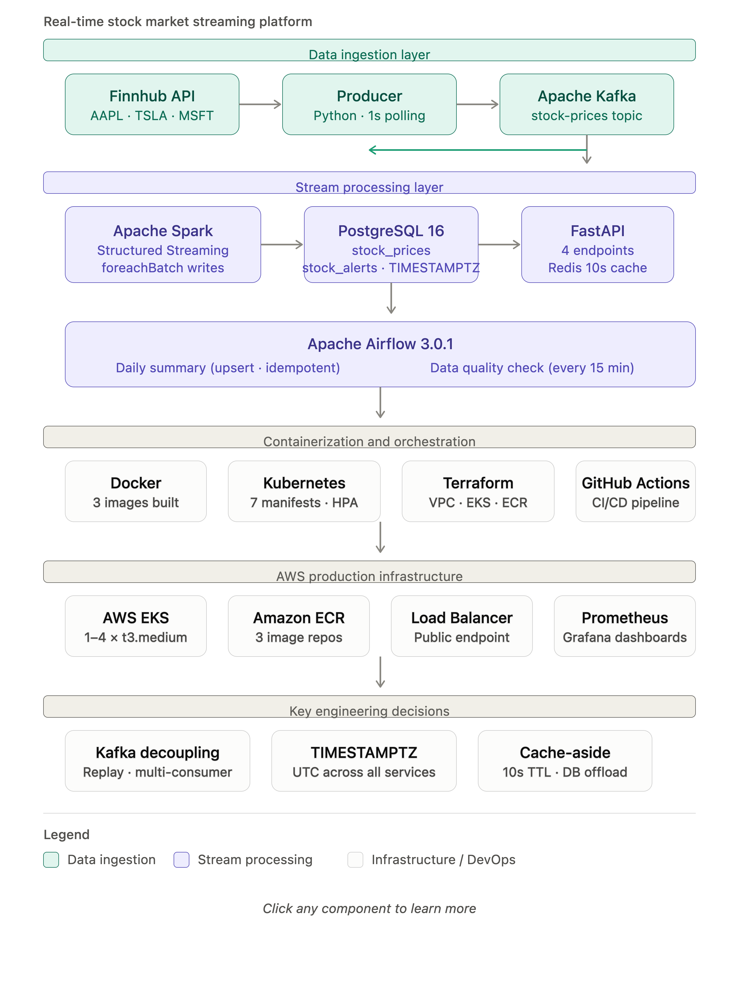

# Real-Time Stock Market Streaming Platform

A production-grade real-time data pipeline that ingests live stock market data, processes it using Apache Spark Structured Streaming, detects price anomalies, and serves insights through a REST API — fully containerized and deployed on AWS EKS.

## Architecture



```
Finnhub API → Producer → Apache Kafka → Apache Spark → PostgreSQL → FastAPI → Redis Cache
                                                    ↓
                                              Stock Alerts
                                                    ↓
                                           Apache Airflow
                                      (Daily Summary + Data Quality)
```

## Tech Stack

| Layer | Technology |
|-------|-----------|
| Data Ingestion | Python, Finnhub API, Apache Kafka |
| Stream Processing | Apache Spark Structured Streaming, PySpark |
| Storage | PostgreSQL 16 (TIMESTAMPTZ), Redis 7 |
| API | FastAPI, Uvicorn, psycopg2 |
| Orchestration | Apache Airflow 3.0.1 |
| Containerization | Docker, Docker Compose |
| Container Orchestration | Kubernetes (AWS EKS) |
| Infrastructure as Code | Terraform |
| CI/CD | GitHub Actions |
| Monitoring | Prometheus, Grafana |
| Cloud | AWS (EKS, ECR, VPC, IAM) |

## Features

- **Real-time ingestion** — polls Finnhub API for AAPL, TSLA, MSFT every second
- **Price alert detection** — Spark flags any price movement exceeding 1% change
- **Redis caching** — 10-second cache on latest prices endpoint reduces DB load
- **Dual Kafka listeners** — separate listeners for host and containerized clients
- **Idempotent ETL** — Airflow daily summary uses upsert to prevent duplicate rows
- **Data quality monitoring** — Airflow checks data freshness every 15 minutes
- **Health probes** — Kubernetes liveness and readiness probes on all services
- **Auto-scaling** — EKS node group scales between 1 and 4 worker nodes

## Project Structure

```
stock-streaming-platform/
├── producer/               # Finnhub API → Kafka producer
│   ├── producer.py
│   └── Dockerfile
├── streaming/              # Spark Structured Streaming job
│   ├── spark_stream.py
│   └── Dockerfile
├── api/                    # FastAPI REST API
│   ├── main.py
│   └── Dockerfile
├── airflow/                # Airflow DAGs
│   └── dags/
│       ├── daily_summary_dag.py
│       └── data_quality_check_dag.py
├── kubernetes/             # Kubernetes manifests
│   └── manifests/
├── terraform/              # AWS infrastructure as code
│   ├── main.tf
│   ├── variables.tf
│   └── outputs.tf
└── .github/workflows/      # CI/CD pipeline
    └── deploy.yml
```

## API Endpoints

| Endpoint | Description |
|----------|-------------|
| GET / | Health check |
| GET /health | Service status |
| GET /prices/latest | Latest price per stock (Redis cached) |
| GET /stocks/{symbol}/history | Last 50 price events for a symbol |
| GET /alerts/recent | Last 20 price alerts |

## Airflow DAGs

| DAG | Schedule | Description |
|-----|----------|-------------|
| daily_stock_summary | @daily | Calculates high, low, avg price per stock with upsert |
| data_quality_check | Every 15 min | Verifies data freshness, alerts if stale |

## Key Technical Decisions

**Why Kafka over direct DB writes?**
Kafka decouples the producer from consumers, enables message replay, and allows multiple independent consumers (Spark, future ML pipeline) without changing the producer.

**Why TIMESTAMPTZ over TIMESTAMP in PostgreSQL?**
Distributed systems run in different timezones. Plain TIMESTAMP stores values without timezone context, causing incorrect calculations when comparing across services. TIMESTAMPTZ normalizes everything to UTC internally.

**Why foreachBatch in Spark?**
foreachBatch gives full control over how each micro-batch is written, allowing conditional writes to two separate tables (prices and alerts) in a single batch pass.

**Why Redis cache-aside with 10 second TTL?**
Stock prices change frequently but not every millisecond. A short TTL balances data freshness with database load reduction for the high-traffic latest prices endpoint.

## Infrastructure

Provisioned with Terraform on AWS:
- VPC with public subnets across 2 availability zones
- EKS cluster with auto-scaling node group (1-4 x t3.medium)
- ECR repositories for all three Docker images
- IAM roles with least-privilege policies

## Local Development

### Prerequisites
- Docker Desktop
- Python 3.13
- Java 17 (for Spark)
- AWS CLI

### Start infrastructure
```bash
docker compose up -d
```

### Run producer
```bash
cd producer && source venv/bin/activate && python3 producer.py
```

### Run Spark streaming
```bash
cd streaming && source venv/bin/activate
spark-submit --packages org.apache.spark:spark-sql-kafka-0-10_2.13:4.1.2,org.postgresql:postgresql:42.7.3 spark_stream.py
```

### Run API
```bash
cd api && source venv/bin/activate && uvicorn main:app --reload --port 8000
```

## Author

Ayesha Najib — Cloud Solutions Architect / DevOps Engineer
AWS SAA | AWS Security Specialty | Azure Solutions Architect Expert (AZ-305) | Azure Security Engineer (AZ-500) | Azure Administrator (AZ-104) | CompTIA Security+
